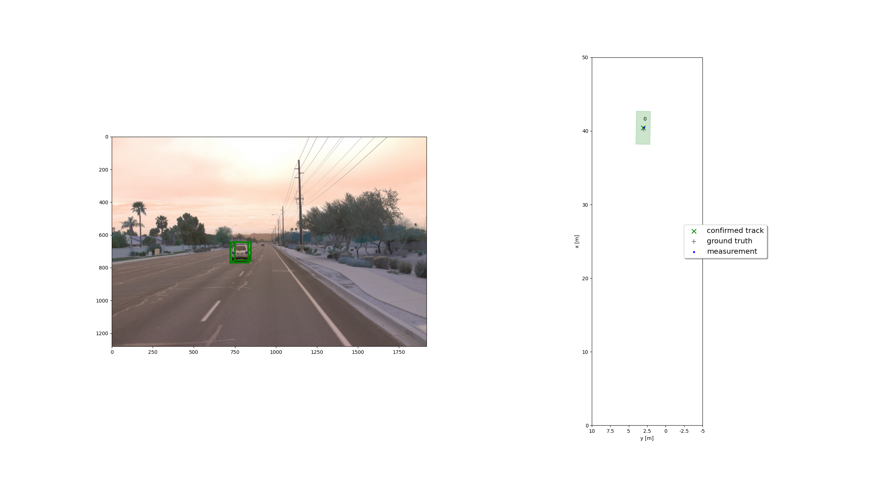
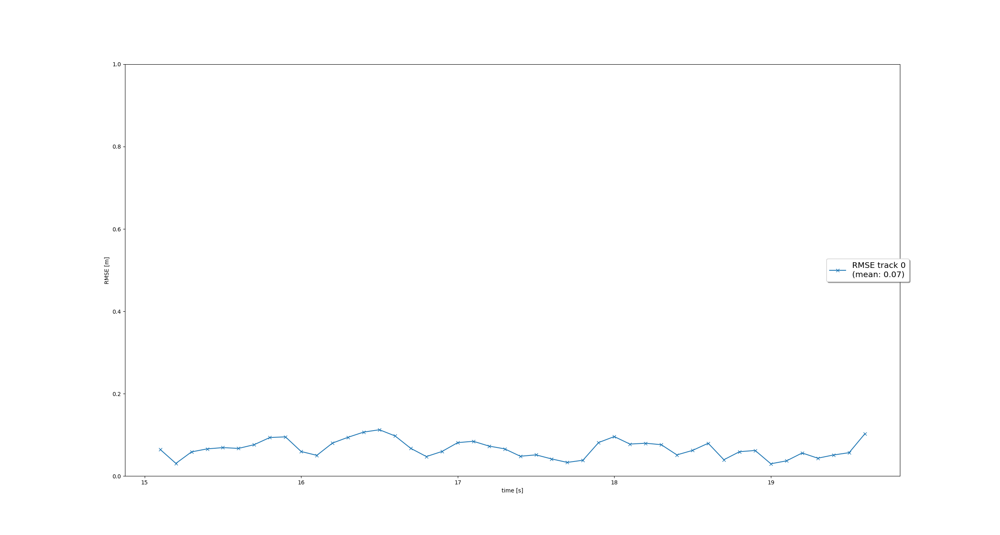
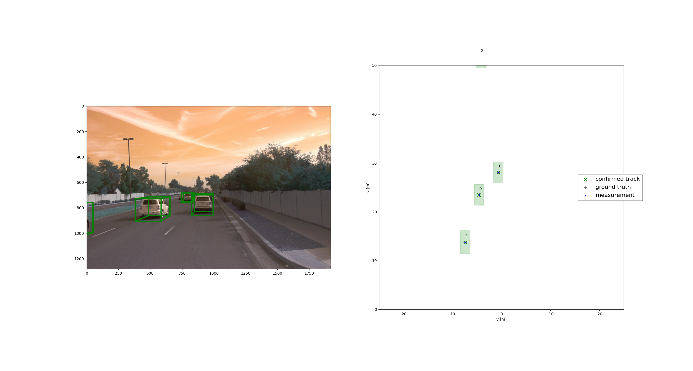
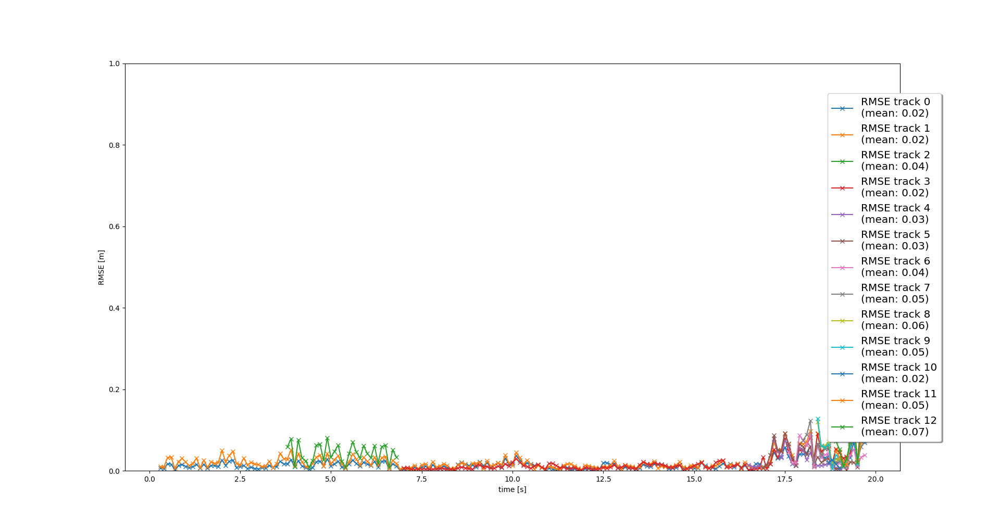
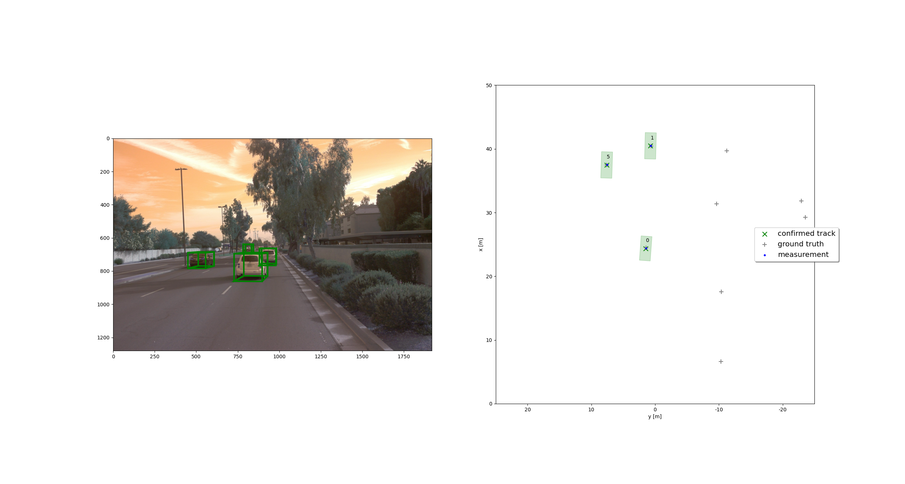
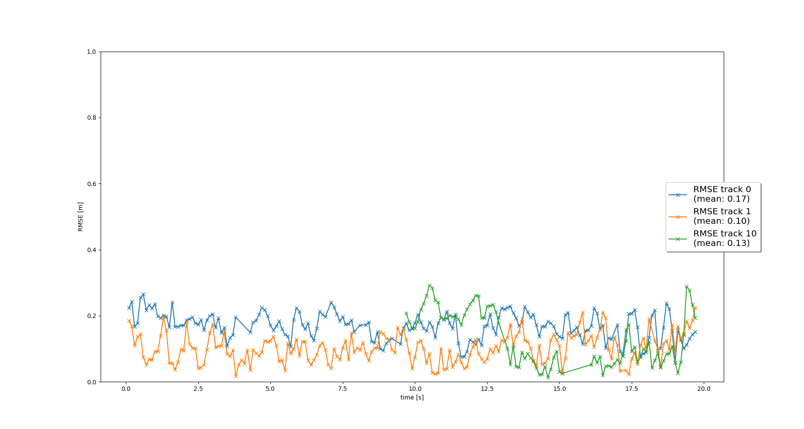
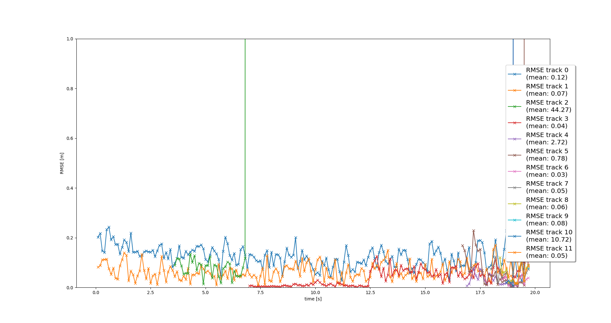

# Writeup: Track 3D-Objects Over Time

The final project consists of four main steps:

- Step 1: Implement an extended Kalman filter.
- Step 2: Implement track management including track state and track score, track initialization and deletion.
- Step 3: Implement single nearest neighbour data association and gating.
- Step 4: Apply sensor fusion by implementing the nonlinear camera measurement model and a sensor visibility check.

Since the final project is based on the mid-term project, same code files are used as in the mid-term.

## Question Session

### 1. Write a short recap of the four tracking steps and what you implemented there (filter, track management, association, camera fusion). Which results did you achieve?

#### Step 1: Extended Kalman Filter (EKF)

To implement an Extended Kalman Filter (EFK), the 6 dimensional system states [x, y, z, vx, vy, vz], process noise Q for constant velocity motion model are designed. To update the current state calculation, h(x) and the Jacobian H are calculated. In the first step, the EKF is applied to simple single-target scenario with lidar only. This is shown in the below figure.

To evaluate the tracking performance, the mean of root mean squared error (RMSE) is calculated. As depicted, the mean RMSE results are smaller than the given reference value 0.35. 

#### Step 2: Track Management
In the second step, the track management is implemented to initialize and delete tracks, set a track state and a track score. First, the track is initialized with unassigned lidar calculation and decrease the track score for unassigned tracks. Then tracks are deleted if the score is too low or P is too big. The below figure shows the single track without track losses in between.

#### Step 3: Data Association
In the data association, the closest neighbor association matches measurements to tracks and decides which track to update with which measurement by using the Mahalanobis Distance (MHD). The MHD measures the distance between a point vs a distribution. The MHD is used to exclude unlikely track pairs by comparing threshold which is created based on the chi-squared distribution. The following figures show the data association results and corresponding rmse results.

#### Step 4: Sensor Fusion
To complete the sensor fusion system, the camera measurements including covariance matrix R are implemented. Therby, the function of ``Sensor`` class called ``in_fov()`` is implemented to check if the input state vector of an object can be seen by this sensor. Here, we have to transform from vehicle to sensor coordinates. Furthermore, a nonlinear camera measurement model h(x) is implemented.

First, I set ``configs_det.use_labels_as_objects`` to `Flase` to see how the tracking performance looks with model-based detection. As shown in the figure with rmse results, only few vehicles are tracked correctly. 

Then, I set ``configs_det.use_labels_as_objects`` to True to see the difference of tracking performance by adding ground truth information. As shown in the below gif, we can see that more vehicles are tracked correctly.

#### Which part of the project was most difficult for you to complete, and why?
Lectures of EKF, Multi-Target Tracking provide a nice guide and exercises in implementation of EKF, track management, data association and sensor fusion. Personally, for me the sensor fusion part was bit difficult, especially camera measuring model. The projection of 3d space to 2d space was error-prone such that I had to deal with multiple implementation errors. In addition, even the entire lectures and project description are well guided, sometimes I was uncertain about my results of step 1 and 2 which show much better results than in description. I thought I made some mistake. 

### 2. Do you see any benefits in camera-lidar fusion compared to lidar-only tracking (in theory and in your concrete results)? 
Theoretically, the tracking performance can be stabilized by fusion of multiple sensor. In camera-lidar fusion, camera provides visual information which may show advantages in classification of objects by including color, contrast and brightness. On the other hand, lidar can provide rich spatial information. Combining the two sensor strengths, better tracking performance can be achieved.

My results, as shown in the step 4, a lot of efforts be spent to improve the detection performances such that better tracking performance can be achieved. Even adding ground truth information in detection phase, significant increase of tracking performance can be expected. 

### 3. Which challenges will a sensor fusion system face in real-life scenarios? Did you see any of these challenges in the project?
- Since camera is a passive environmental sensor, the detection accuracy might be influenced by lighting conditions. This will lead to decrease of tracking performance.
- When many objects come too close, the occlusion can occur that often leads to wrong tracking of occluded objects.

### 4. Can you think of ways to improve your tracking results in the future?
- Advanced design of process noise covariance might be a conceivable solution to achieve better tracking performance.
- Instead of using `fpn_resnet`, different pretrained neural networks can be used to compare the tracking performances. 
